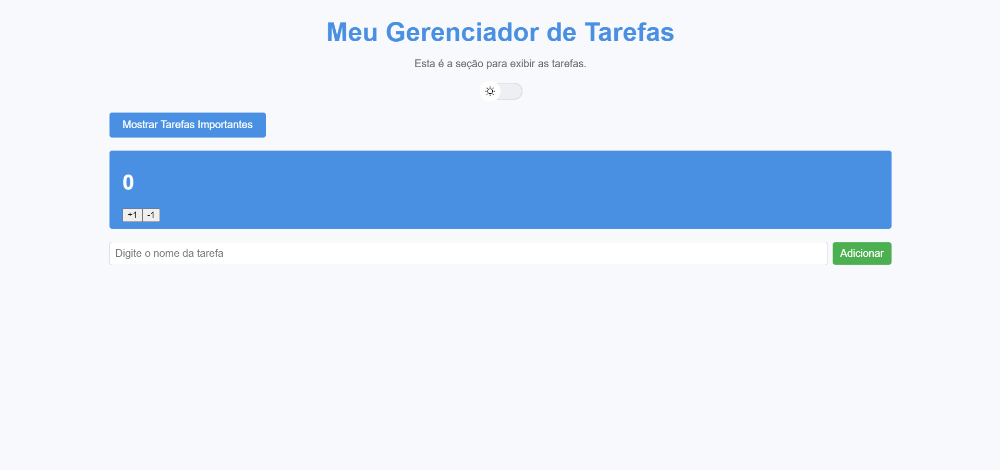
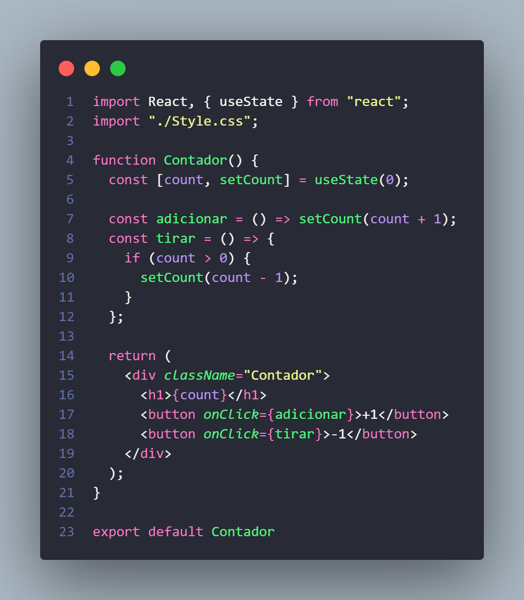
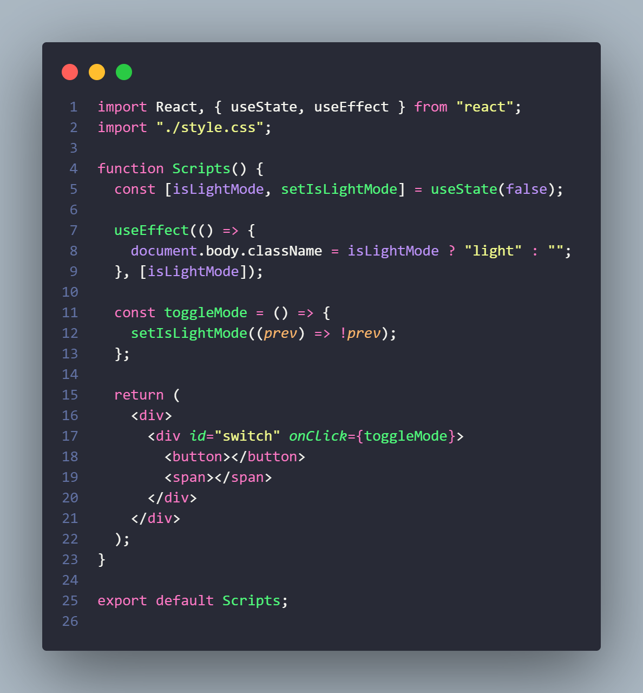
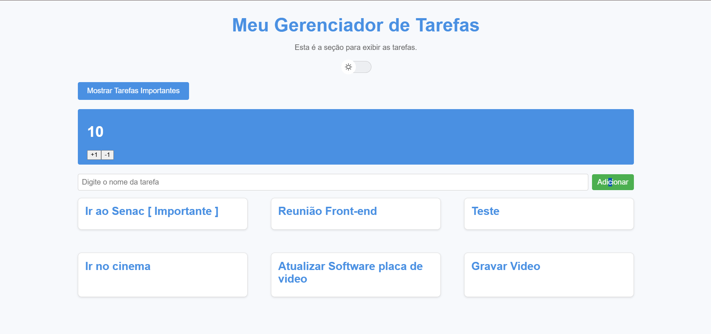
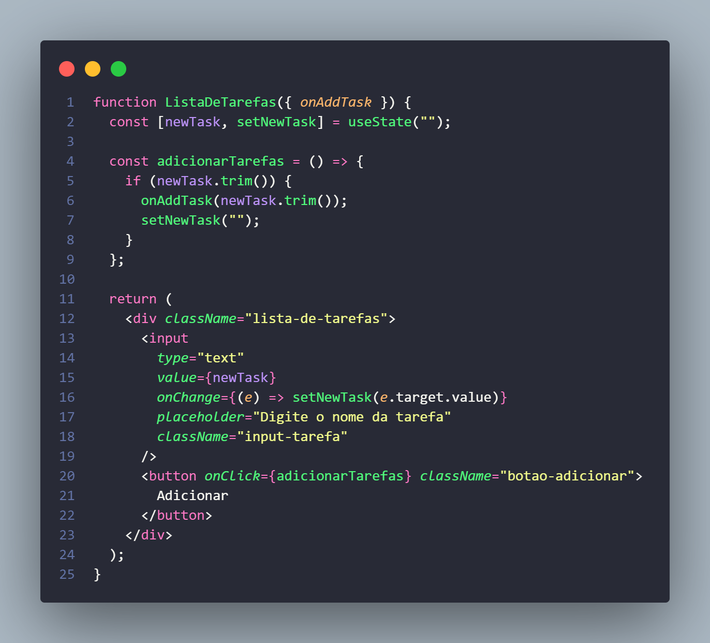

## Exercício React elements JSX

Inicialmente criamos um nono Workspace e instalamos tudo que precisava.

em seguida criamos 3 componentes sendo eles:

- Header.js.
- TaskContainer.jsx
- Task.jsx

o Header e responsavel pela parte de cima do site onde exibimos o titulo e em seguida o TaskContainer/Task para armazenar os elementos e exibir no site.

# Explicação das alteraçoes feitas:

adicinei o css no app.css para adicionar estilo a Lista de Tarefas

fiz um botao separado em na pasta components (Button.js) para melhorar a modularidade.
Ele recebe via props:
onClick: A função toggleTaskView para alternar o estado.
isShowingAll: O estado atual para exibir o texto correto no botão.

### Foi adicionado o estado todasTarefas no TaskContainer para controlar a exibição das tarefas.

- true: Exibe todas as tarefas da lista.
- false: Exibe apenas as tarefas que forem marcadas como importante.

Quando todasTarefas é true, mostra todas.
Quando é false, filtra as tarefas usando filter e include onde escolhi a palavra " Importantes" para ele filtar.

Sempre que o usuario quiser marcar uma anotaçao como importante ele tera que escrever no titulo como mostrado nas imagens seguintes...

## Tela inicial da Lista de Tarefas

## Tela das listas marcadas como importantes assim que clicado no botao

## Atualizaçoes feita

# Exercícios com React e `useState`

Este projeto contém três componentes que utilizam o hook `useState` para gerenciar estados no React.

## Componentes Criados

### 1. Contador

- **Descrição**: Um contador simples que começa em 0.
- **Funcionalidades**:
  - Incrementa o número ao clicar no botão "+1".
  - Decrementa o número ao clicar no botão "-1".
  - Impede que o número fique negativo.

### Estrutura do Código

### Importação de `useState`

`const [count, setCount] = useState(0);`

- **O que faz**: O `useState` é um hook do React que cria uma variável de estado (neste caso, `count`) e uma função para atualizá-la (`setCount`).
- **Valor inicial**: O contador começa com o valor `0`.

### Função `adicionar`

`const adicionar = () => setCount(count + 1);`

- **O que faz**: Esta função incrementa o valor de `count` em 1 sempre que for chamada.
- **Como é usada**: É acionada pelo botão `+1`.

### Função `tirar`

-**O que faz**: Verifica se o valor de count é maior que 0. Se for, subtrai 1 do valor atual.
Por que tem a condição: Evita que o contador fique com valores negativos.

### 2. Botão Alternador

- **Descrição**: Um botão que alterna entre Escuro ou Claro o Fundo da Lista de Tarefas.
- **Funcionalidades**:

  - Alterna o estado ao ser clicado.
  - Muda a cor do Fundo para Branco (Desligado) ou Escuro (Ligado).

  

### Esttrutura do Código do Scripts

Este código é um componente React que implementa um **alternador de modo** (tema claro ou Escuro) usando estado e efeitos. Ele adiciona ou remove uma classe no `body` da página para aplicar estilos correspondentes.

### Estado `isLightMode`

- **O que faz**: Este efeito é acionado sempre que o valor de isLightMode muda.
  Se isLightMode for true, adiciona a classe light ao body.
  Se isLightMode for false, remove a classe.
  Resultado esperado: A classe aplicada ao body altera o estilo da página, dependendo do tema ativo.

### 3. Lista de Tarefas

- **Descrição**: Um campo de texto para digitar o nome da tarefa e depois adicionala.
- **Funcionalidades**:
  - Permite adicionar uma tarefa ao digitar no campo de texto e clicar no botão "Adicionar".
  - Exibe as tarefas em uma lista.

### Estrutura do Codigo

Este código implementa um componente React para adicionar tarefas a uma lista. Ele permite capturar uma tarefa no campo de texto e enviá-la para o componente pai através da função `onAddTask`.

### Componente `ListaDeTarefas`

- **Props**:
- onAddTask: Função passada como prop para adicionar uma nova tarefa ao componente pai.
- Estado Local:
  newTask: Armazena o valor do campo de entrada onde o usuário digita a nova tarefa.
- setNewTask: Função para atualizar o estado de newTask.
- newTask.trim(): Remove espaços em branco no início e no fim da string antes de enviar a tarefa.
  Condição:
- if (newTask.trim()): Verifica se o campo não está vazio antes de enviar a tarefa.
- onAddTask(newTask.trim()): Chama a função passada como prop (onAddTask) enviando o valor da nova tarefa para o componente pai.
- setNewTask(""): Limpa o campo de entrada após enviar a tarefa com sucesso.

