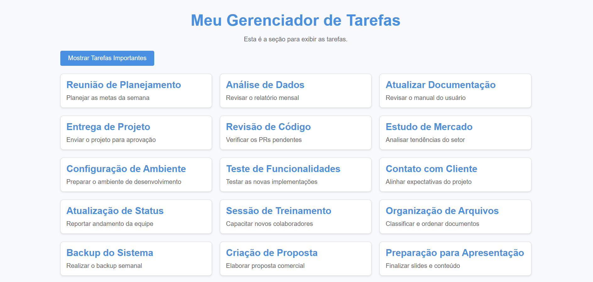

## Exercício React elements JSX

Inicialmente criamos um nono Workspace e instalamos tudo que precisava.

em seguida criamos 3 componentes sendo eles:

- Header.js.
- TaskContainer.jsx
- Task.jsx

o Header e responsavel pela parte de cima do site onde exibimos o titulo e em seguida o TaskContainer/Task para armazenar os elementos e exibir no site.

# Explicação das alteraçoes feitas:

adicinei o css no app.css para adicionar estilo a Lista de Tarefas

fiz um botao separado em na pasta components (Button.js) para melhorar a modularidade.
Ele recebe via props:
onClick: A função toggleTaskView para alternar o estado.
isShowingAll: O estado atual para exibir o texto correto no botão.

### Foi adicionado o estado todasTarefas no TaskContainer para controlar a exibição das tarefas.

- true: Exibe todas as tarefas da lista.
- false: Exibe apenas as tarefas que forem marcadas como importante.

Quando todasTarefas é true, mostra todas.
Quando é false, filtra as tarefas usando filter e include onde escolhi a palavra " Importantes" para ele filtar.

Sempre que o usuario quiser marcar uma anotaçao como importante ele tera que escrever no titulo como mostrado nas imagens seguintes...

## Tela inicial da Lista de Tarefas

## Tela das listas marcadas como importantes assim que clicado no botao

## Atualizaçoes feita

# Exercícios com React e `useState`

Este projeto contém três componentes que utilizam o hook `useState` para gerenciar estados no React.

## Componentes Criados

### 1. Contador

- **Descrição**: Um contador simples que começa em 0.
- **Funcionalidades**:
  - Incrementa o número ao clicar no botão "+1".
  - Decrementa o número ao clicar no botão "-1".
  - Impede que o número fique negativo.

### 2. Botão Alternador

- **Descrição**: Um botão que alterna entre Escuro ou Claro o Fundo da Lista de Tarefas.
- **Funcionalidades**:

  - Alterna o estado ao ser clicado.
  - Muda a cor do Fundo para Branco (Ligado) ou Escuro (Desligado).

  

### 3. Lista de Tarefas

- **Descrição**: Um aplicativo para gerenciar uma lista de tarefas.
- **Funcionalidades**:
  - Permite adicionar uma tarefa ao digitar no campo de texto e clicar no botão "Adicionar".
  - Exibe as tarefas em uma lista.

